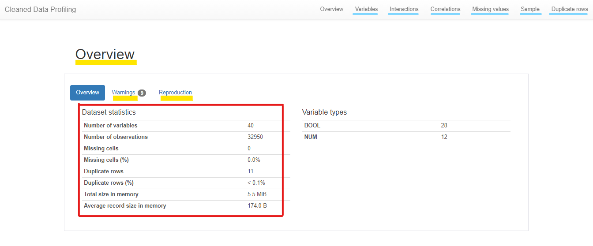

# Optimizing an ML Pipeline in Azure

## Overview
This project is part of the Udacity Azure ML Nanodegree.
In this project, we build and optimize an Azure ML pipeline using the Python SDK and a provided Scikit-learn model.
This model is then compared to an Azure AutoML run.

## Summary
- This dataset contains information related to a direct marketing campaign of a Portuguese banking institution and if their clients did subscribe for a term deposit. 
We seek to predict if clients are subscibed for a term deposit based on the provided personal and financial information.

- The best performing model is a SoftVotingClassifier (VotingEnsemble), containing MaxAbcScaler and XGBoostClassifier which implements the Gradient tree boosting algorithm_  well known for its efficiency to predict accuracies. 
This model has been chosen among several models based on the highest accuracy, while tuning the hyperdrive parameters during the experiment.

## Scikit-learn Pipeline

Below a general pipeline architecture is provided to explain the workflow of using Azure SDK with HyperDrive parameterization:

Getting good or bad results is related to how well prepared your model is?  
### **Data Preparation:**  
The first part of the process will be to prepare the script to use. The main performed actions inside the _train.py_ script are:  
   - Retrieve data from the specified path using the TabularDatasetFactory method. 
   - Convert the dataset to a binary data representation by applying the _SKLearn get_dummies() method_, to use later with  
   - Split data into training and testing sets, using Sklearn function  *train_test_split* . 
   - Apply the SKLearn _LogisticRegression classifier_ by including the sample parameters, then fit the split data. 
   - Finally, verify the calculated accuracy and register the best model. 
The problem with manually handling predictions is the time lost while trying to tune the parameters seeking the best result. 
Hence, the benefit of Azure HyperDrive is finding the perfect fit by tuning the hyperdrive parameters among a pre-specified random set of your choice. 

### **Data Training & Validation:**  
This is a repeatable process for each run of the experiment, specifying a random hyperparameter from a given list of choices.
To prepare the HyperDrive configuration, we need to set three major parameters including: 

   1- Specify a **parameter sampler**: since we are using the SKLearn _LogisticRegression classifier_  we will be using: 
   
   - The inverse of regularization strength _**C**_ with a default value of _1.0_, you need to specify a discrete set of options to sample from. 
   - And, the maximum number of iterations taken for the solvers to converge _**max_iter**_  
      
   2- Specify an **early termination policy**: Among three types, we decided to work with the _Bandit Policy_, classified as an aggressive saving, as it will terminate any job based on a _slack_ criteria, and a _frequency_ and _delay_ interval for evaluation.  
   
   - slack_factor: Specified as a ratio used to calculate the allowed distance from the best performing experiment run. 
   - evaluation_interval: Reflects the frequency for applying the policy. 
   - delay_evaluation: Reflects the number of intervals for which to delay the first policy evaluation. 
      
   3 - Create a SKLearn **estimator** to use later within the HyperDriveConfig definition. 
   The estimator contains the _source directory_ The path to the script directory, the _compute target_, and the _entry script_ The name of the script to use along with the experiment.  
   
After creating the **HyperDriveConfig** using the mentioned above parameters, we submit the experiment by specifying the recently created HyeperDrive configuration. 

 ### **Model Deployment:**  
 This phase is related to provisioning, visioning, access control, and scaling. However, as a first project, we focused on the registration of the  best-run model and how to explore its different metrics and features using Microsoft Azure ML studio tools. 
 
And since it's directly related to CI/CD concept with Azure, we can proceed with an endpoint deployment for further use of the generated model. 

When we talk about using a parameter sampler, we need to highlight two steps:

   - **The hyperparameter type: Discrete or Continuous?** In our case, we used the discrete type because this project is about categorization.  
   - **The sampling type: Grid or Random or Bayesian sampling?** Based on the previous workshops, both grid and random yielded good results. However, and because all our hyperparameters values are discrete, we must apply the grid sampling. 
  
For this project search space definition, I used  _C_ and _iter_max_ hyperparameters and created for each a dictionary with the appropriate parameter expression.

That being said, parameter sampler benefits are: 

   - Automate the finding hyperparameters configuration process that results in the best performance by simultaneously running experiments and optimizing hyperparameters.
   - Decrease the process of computing expenses, errors, and trials' number.

As explained above, the early termination policy aims to terminate poorly performing runs automatically. Azure ML supports three types:

   - _Median Stopping policy_: Based on running averages of primary metrics reported by the runs.  
   - _Truncation selection policy_: Cancels a percentage of lowest-performing runs at each evaluation interval.  It's an aggressive saving mode with a bit of fairness on how and if it would terminate the job based on a given percentage and compared to other runs within the same time interval.
   - _Bandit policy_: Based on slack factor/slack amount and evaluation interval. I used this type of termination policy because I wanted an **aggressive strict saving mode** that terminates the job if it doesn't apply with the specified slack. 
   
PS: If no policy is specified, the hyperparameter tuning service will let all training runs execute to completion, which will increase computational resources usage.

## AutoML

The first thing I noticed when using Azure AutoML was the speed and the efficiency of the generated model. 
AutoML is an automation of the machine learning process from data processing to finding the perfect model for your problem.  
Applying AutoML to our problem took me one hour from defining parameters and autoMl configuration to getting the best run model with its log, metrics, and run children.  
A wide variety of features and metrics, also, the use of the visualization methods like RunDetails of Widget library. 
The coolest library  I discovered while I was digging about AutoML usage and utility was _pandas_profiling_.   I was personally astonished by the quality and the number of visualization metrics and charts it can generate from your data. It can be really usefull for data analysis step, containing six analytical sections, a part of an overview of the dataset statistics, and a warning panel talking about problems found within the provided dataset.  
Below some screenshots of the generated **interactive report** using the _pandas profiling_ library:

To submit an experiment using Azure ML SDK, you need to set an AutoML configuration using the **AutoMLConfig** class.

The **AutoMLConfig** class holds a wide range of optional and required parameters.For this project I used:  

   - _experiment_timeout_minutes_: Maximum time in minutes that each iteration can run for before it terminates. . 
   - _task_:  The type of task to run: regression, classification or forecasting.  
   - _primary_metric_: The metric to be optimized for model selection.  
   - _training_data_: Data to train the autoML. 
   - _label_column_name_: The name of the output label column. 
   - n_cross_validations: How many cross-validations to perform when user validation data is not specified.  
   - _iterations_: The total number of different algorithm and parameter combinations to test during an automated ML experiment. 
   - _max_concurrent_iterations_: Represents the maximum number of simultaneously executed iterations. 
   - _compute_target_: The compute target to run the experiment on. 

The below screenshot is the models' list resulting from the run experiment using AutoML:

## Pipeline comparison

Comparing the two models and their performance, I spotted that :

   - The best accuracy using Azure HyperDrive is 0.909, which is pretty good but slightly different from AutoML's best result: 0.917.   
   - In fact, AutoML's accuracy is better because it uses a wide range of complex algorithms, which is hard to apply with HyperDrive because we will need a pipeline per model. 
   
This is the best run model generated by HyperDrive model: 

Now let's take a look at some of the AutoML generated metrics and the best run model: 

The distribution of loans by age range: 

List of all metrics of the AutoML best run model:

## Future work

Exploring the dataset profiling report, I noticed a data imbalance warning. Trying to find out the issue, I come across some interesting solutions to enhance the training data.   
 It would be great to apply those fixes and compare results with the one generated by AuoML. 
I also want to remove the clean data step before running the AutoML experiment to see how relevant is it the cleaning done by AutoML.
Finally, I am eager to fix the cloud shell error about storage limitations that I encountred when trying to run the model.

## Proof of cluster clean up

below, the delete proof of the compute target

